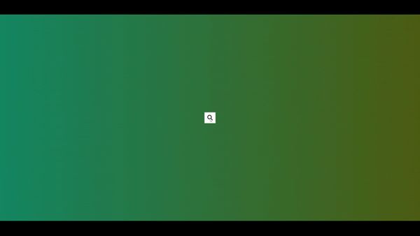

# Hidden Search Widget

## 🚀 Overview

This project features a "Hidden Search" functionality where a search input field expands when clicked, providing a smooth and interactive experience. It's perfect for minimalist designs where space is a premium.

### 🎯 Project Goals:
- Implement a button with a search icon using Font Awesome.
- Use JavaScript to trigger an event that expands the search input field when the button is clicked.
- Add CSS transitions to smoothly increase the input field's width and move the button using `transform: translateX()`.
- Ensure that clicking the button again shrinks the input field back to its original size.

## 🛠️ Built With

- [HTML5](https://www.w3schools.com/html/)
- [CSS3](https://www.w3schools.com/css/)
- [JavaScript](https://www.w3schools.com/js/)

